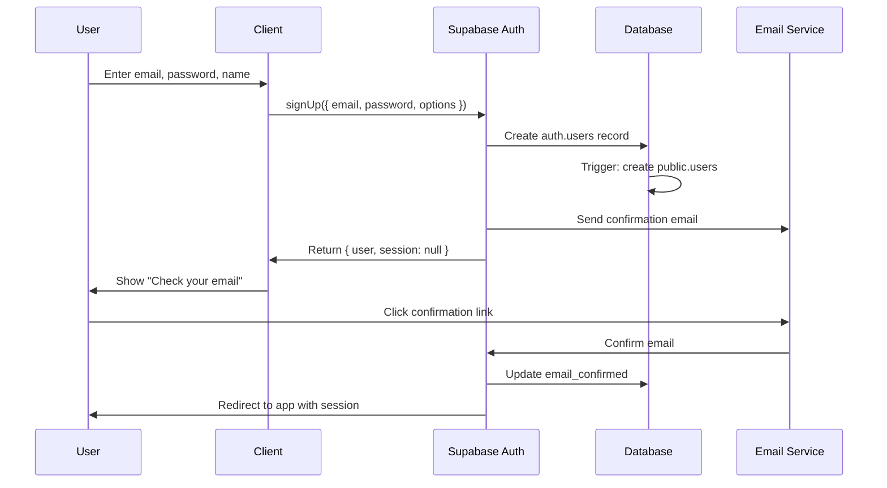
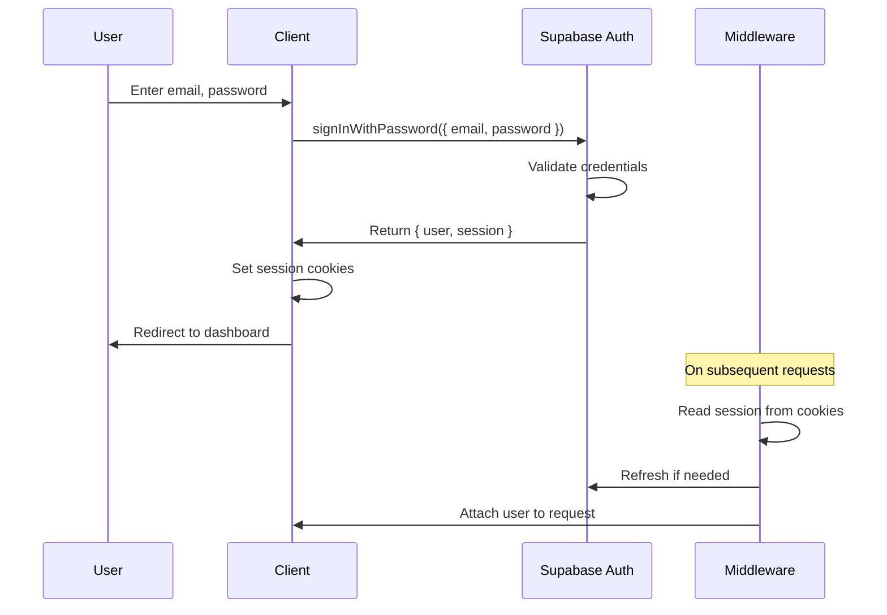
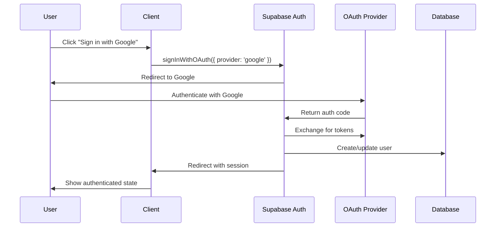
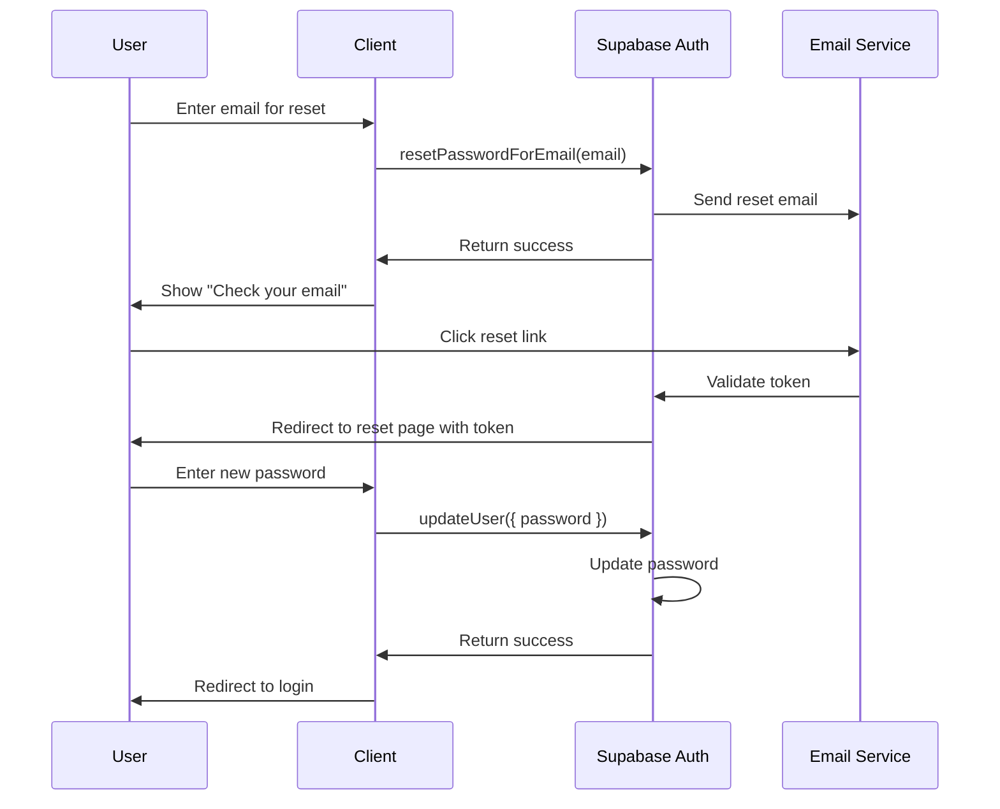
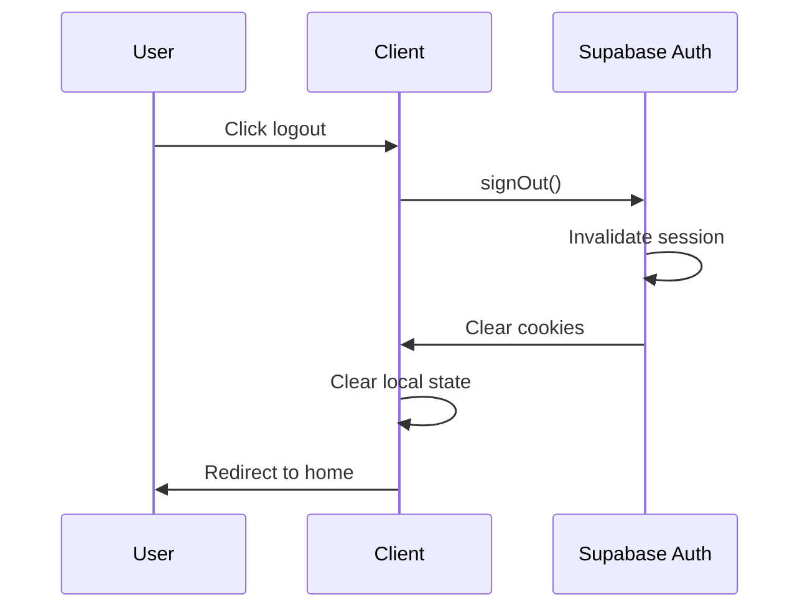

# EUONGELION Authentication Flow Documentation

## Overview

EUONGELION uses **Supabase Auth** for authentication, providing secure, scalable authentication with support for email/password, OAuth providers (Google, Apple), and anonymous sessions. The implementation uses the `@supabase/ssr` package for server-side rendering compatibility with Next.js 15.

---

## Architecture

```
┌──────────────────────────────────────────────────────────────────┐
│                         Client (Browser)                          │
│  ┌─────────────┐  ┌─────────────┐  ┌─────────────────────────┐   │
│  │ Login Form  │  │ OAuth Btns  │  │ Supabase Browser Client │   │
│  └──────┬──────┘  └──────┬──────┘  └───────────┬─────────────┘   │
│         │                │                      │                 │
└─────────┼────────────────┼──────────────────────┼─────────────────┘
          │                │                      │
          ▼                ▼                      ▼
┌──────────────────────────────────────────────────────────────────┐
│                         Supabase Auth                             │
│  ┌─────────────┐  ┌─────────────┐  ┌─────────────────────────┐   │
│  │  Email Auth │  │ OAuth Flow  │  │    Session Management   │   │
│  └─────────────┘  └─────────────┘  └─────────────────────────┘   │
└──────────────────────────────────────────────────────────────────┘
          │                │                      │
          ▼                ▼                      ▼
┌──────────────────────────────────────────────────────────────────┐
│                         Next.js Middleware                        │
│  ┌─────────────────────────────────────────────────────────────┐ │
│  │ Session Refresh | Route Protection | Cookie Management     │ │
│  └─────────────────────────────────────────────────────────────┘ │
└──────────────────────────────────────────────────────────────────┘
```

---

## Client Setup

### Browser Client

**Location**: `/app/lib/supabase/client.ts`

```typescript
import { createBrowserClient } from '@supabase/ssr';
import type { Database } from '@/types/database';

let client: ReturnType<typeof createBrowserClient<Database>> | null = null;

export function createClient() {
  if (client) return client;

  client = createBrowserClient<Database>(
    process.env.NEXT_PUBLIC_SUPABASE_URL!,
    process.env.NEXT_PUBLIC_SUPABASE_ANON_KEY!
  );

  return client;
}
```

- Singleton pattern for browser
- Type-safe with database types
- Uses anon key (public, RLS-protected)

### Server Client

**Location**: `/app/lib/supabase/server.ts`

```typescript
import { createServerClient } from '@supabase/ssr';
import { cookies } from 'next/headers';
import type { Database } from '@/types/database';

export async function createClient() {
  const cookieStore = await cookies();

  return createServerClient<Database>(
    process.env.NEXT_PUBLIC_SUPABASE_URL!,
    process.env.NEXT_PUBLIC_SUPABASE_ANON_KEY!,
    {
      cookies: {
        getAll() {
          return cookieStore.getAll();
        },
        setAll(cookiesToSet) {
          try {
            cookiesToSet.forEach(({ name, value, options }) =>
              cookieStore.set(name, value, options)
            );
          } catch {
            // Ignored in Server Components
          }
        },
      },
    }
  );
}
```

- New instance per request
- Accesses cookies for session
- Works in Server Components and API routes

### Admin Client

**Location**: `/app/lib/supabase/server.ts`

```typescript
export async function createAdminClient() {
  const cookieStore = await cookies();

  return createServerClient<Database>(
    process.env.NEXT_PUBLIC_SUPABASE_URL!,
    process.env.SUPABASE_SERVICE_ROLE_KEY!, // Service role key
    {
      cookies: {
        // ... cookie handlers
      },
    }
  );
}
```

- Uses service role key (bypasses RLS)
- Only for admin operations
- Never expose to client

---

## Authentication Flows

### 1. Email/Password Sign Up



**Implementation**:
```typescript
const signUp = async (email: string, password: string, displayName: string) => {
  const supabase = createClient();

  const { data, error } = await supabase.auth.signUp({
    email,
    password,
    options: {
      data: {
        full_name: displayName,
      },
      emailRedirectTo: `${window.location.origin}/auth/callback`,
    },
  });

  if (error) throw error;
  return data;
};
```

**Notes**:
- Email confirmation is required by default
- `emailRedirectTo` specifies where to redirect after confirmation
- User metadata (`data.full_name`) is stored in `auth.users.raw_user_meta_data`
- Database trigger creates corresponding `public.users` record

---

### 2. Email/Password Login



**Implementation**:
```typescript
const signIn = async (email: string, password: string) => {
  const supabase = createClient();

  const { data, error } = await supabase.auth.signInWithPassword({
    email,
    password,
  });

  if (error) {
    if (error.message === 'Invalid login credentials') {
      throw new Error('Invalid email or password');
    }
    throw error;
  }

  return data;
};
```

**Session Tokens**:
- Access token: Short-lived JWT (1 hour default)
- Refresh token: Long-lived (1 week default)
- Both stored in httpOnly cookies

---

### 3. OAuth Login (Google/Apple)



**Implementation**:
```typescript
const signInWithGoogle = async () => {
  const supabase = createClient();

  const { data, error } = await supabase.auth.signInWithOAuth({
    provider: 'google',
    options: {
      redirectTo: `${window.location.origin}/auth/callback`,
      queryParams: {
        access_type: 'offline',
        prompt: 'consent',
      },
    },
  });

  if (error) throw error;
  return data;
};
```

**Callback Handler** (`/app/auth/callback/route.ts`):
```typescript
import { createClient } from '@/lib/supabase/server';
import { NextResponse } from 'next/server';

export async function GET(request: Request) {
  const requestUrl = new URL(request.url);
  const code = requestUrl.searchParams.get('code');
  const next = requestUrl.searchParams.get('next') ?? '/';

  if (code) {
    const supabase = await createClient();
    const { error } = await supabase.auth.exchangeCodeForSession(code);

    if (!error) {
      return NextResponse.redirect(new URL(next, requestUrl.origin));
    }
  }

  return NextResponse.redirect(new URL('/auth/error', requestUrl.origin));
}
```

---

### 4. Password Reset



**Request Reset**:
```typescript
const resetPassword = async (email: string) => {
  const supabase = createClient();

  const { error } = await supabase.auth.resetPasswordForEmail(email, {
    redirectTo: `${window.location.origin}/auth/reset-password`,
  });

  if (error) throw error;
};
```

**Update Password**:
```typescript
const updatePassword = async (newPassword: string) => {
  const supabase = createClient();

  const { error } = await supabase.auth.updateUser({
    password: newPassword,
  });

  if (error) throw error;
};
```

---

### 5. Logout



**Implementation**:
```typescript
const signOut = async () => {
  const supabase = createClient();

  // Clear server session
  const { error } = await supabase.auth.signOut();
  if (error) throw error;

  // Clear client state
  useAuthStore.getState().setSession(null);

  // Redirect
  window.location.href = '/';
};
```

---

## Session Management

### Middleware Session Refresh

**Location**: `/app/lib/supabase/middleware.ts`

```typescript
import { createServerClient } from '@supabase/ssr';
import { NextResponse, type NextRequest } from 'next/server';

export async function updateSession(request: NextRequest) {
  let supabaseResponse = NextResponse.next({ request });

  const supabase = createServerClient<Database>(
    process.env.NEXT_PUBLIC_SUPABASE_URL!,
    process.env.NEXT_PUBLIC_SUPABASE_ANON_KEY!,
    {
      cookies: {
        getAll() {
          return request.cookies.getAll();
        },
        setAll(cookiesToSet) {
          cookiesToSet.forEach(({ name, value }) =>
            request.cookies.set(name, value)
          );
          supabaseResponse = NextResponse.next({ request });
          cookiesToSet.forEach(({ name, value, options }) =>
            supabaseResponse.cookies.set(name, value, options)
          );
        },
      },
    }
  );

  // Refresh session if expired
  const { data: { user } } = await supabase.auth.getUser();

  return supabaseResponse;
}
```

**How it works**:
1. Middleware runs on every request
2. Reads session from cookies
3. Calls `getUser()` to validate/refresh
4. If expired, uses refresh token automatically
5. Updates cookies with new tokens

---

### Auth State in Components

```typescript
// Hook for client components
function useAuth() {
  const [user, setUser] = useState<User | null>(null);
  const [loading, setLoading] = useState(true);
  const supabase = createClient();

  useEffect(() => {
    // Get initial session
    supabase.auth.getSession().then(({ data: { session } }) => {
      setUser(session?.user ?? null);
      setLoading(false);
    });

    // Listen for changes
    const { data: { subscription } } = supabase.auth.onAuthStateChange(
      (_event, session) => {
        setUser(session?.user ?? null);
      }
    );

    return () => subscription.unsubscribe();
  }, []);

  return { user, loading };
}
```

---

## Route Protection

### Protected Routes (Middleware)

**Location**: `/app/middleware.ts`

```typescript
const PROTECTED_ROUTES = [
  '/dashboard',
  '/profile',
  '/settings',
  '/bookmarks',
  '/progress',
];

const PUBLIC_ROUTES = [
  '/',
  '/auth/login',
  '/auth/signup',
  '/auth/reset-password',
  '/devotional', // Allow viewing without auth
  '/series',
];

export async function middleware(request: NextRequest) {
  const { pathname } = request.nextUrl;

  // Check if route needs protection
  const isProtectedRoute = PROTECTED_ROUTES.some(route =>
    pathname.startsWith(route)
  );

  if (isProtectedRoute) {
    const supabaseResponse = await updateSession(request);

    // Get user from refreshed session
    const supabase = createServerClient(/* ... */);
    const { data: { user } } = await supabase.auth.getUser();

    if (!user) {
      // Redirect to login
      const url = request.nextUrl.clone();
      url.pathname = '/auth/login';
      url.searchParams.set('redirect', pathname);
      return NextResponse.redirect(url);
    }

    return supabaseResponse;
  }

  return NextResponse.next();
}
```

### Protected API Routes

```typescript
// /app/api/user/progress/route.ts
export async function GET(request: NextRequest) {
  const supabase = await createClient();
  const { data: { user }, error } = await supabase.auth.getUser();

  if (error || !user) {
    return NextResponse.json(
      { error: 'UNAUTHORIZED', message: 'Authentication required' },
      { status: 401 }
    );
  }

  // Continue with authenticated request
  const { data } = await supabase
    .from('user_progress')
    .select('*')
    .eq('user_id', user.id);

  return NextResponse.json({ data });
}
```

---

## Security Considerations

### 1. Cookie Configuration

```typescript
const COOKIE_OPTIONS = {
  httpOnly: true,      // Prevent XSS access
  secure: true,        // HTTPS only in production
  sameSite: 'lax',     // CSRF protection
  path: '/',           // Available site-wide
  maxAge: 60 * 60 * 24 * 7, // 1 week
};
```

### 2. CSRF Protection

- `sameSite: 'lax'` cookies prevent CSRF
- State parameter in OAuth flows
- Verify origin in sensitive operations

### 3. Rate Limiting

```typescript
// Supabase has built-in rate limiting
// Additional rate limiting in middleware
const RATE_LIMITS = {
  login: { attempts: 5, windowMs: 15 * 60 * 1000 },
  signup: { attempts: 3, windowMs: 60 * 60 * 1000 },
  passwordReset: { attempts: 3, windowMs: 60 * 60 * 1000 },
};
```

### 4. Password Requirements

Configured in Supabase Dashboard:
- Minimum 8 characters
- At least one uppercase letter
- At least one lowercase letter
- At least one number

### 5. Session Security

- Short-lived access tokens (1 hour)
- Refresh tokens with rotation
- Automatic session refresh in middleware
- Clear sessions on password change

---

## Error Handling

### Common Auth Errors

| Error | Cause | User Message |
|-------|-------|--------------|
| `Invalid login credentials` | Wrong email/password | Invalid email or password |
| `Email not confirmed` | Unverified email | Please verify your email |
| `User already registered` | Duplicate signup | Account already exists |
| `Password too weak` | Weak password | Password must be stronger |
| `Token expired` | Reset link expired | Reset link has expired |
| `Invalid token` | Tampered token | Invalid reset link |

### Error Handling Pattern

```typescript
try {
  await signIn(email, password);
} catch (error) {
  if (error instanceof AuthApiError) {
    switch (error.status) {
      case 400:
        setError('Invalid email or password');
        break;
      case 422:
        setError('Please verify your email first');
        break;
      case 429:
        setError('Too many attempts. Please try again later.');
        break;
      default:
        setError('An error occurred. Please try again.');
    }
  } else {
    setError('Network error. Please check your connection.');
  }
}
```

---

## Testing Authentication

### Unit Tests

```typescript
import { createClient } from '@/lib/supabase/client';

// Mock Supabase client
jest.mock('@/lib/supabase/client', () => ({
  createClient: jest.fn(() => ({
    auth: {
      signInWithPassword: jest.fn(),
      signUp: jest.fn(),
      signOut: jest.fn(),
      getUser: jest.fn(),
    },
  })),
}));

describe('Auth', () => {
  it('should sign in with valid credentials', async () => {
    const mockSupabase = createClient();
    mockSupabase.auth.signInWithPassword.mockResolvedValue({
      data: { user: { id: '123' }, session: { access_token: 'token' } },
      error: null,
    });

    const result = await signIn('test@example.com', 'password');
    expect(result.user.id).toBe('123');
  });
});
```

### E2E Tests

```typescript
describe('Login Flow', () => {
  it('should login and redirect to dashboard', () => {
    cy.visit('/auth/login');
    cy.get('input[name="email"]').type('test@example.com');
    cy.get('input[name="password"]').type('password123');
    cy.get('button[type="submit"]').click();
    cy.url().should('include', '/dashboard');
  });
});
```

---

## Environment Variables

Required for authentication:

```env
# Supabase
NEXT_PUBLIC_SUPABASE_URL=https://your-project.supabase.co
NEXT_PUBLIC_SUPABASE_ANON_KEY=your-anon-key
SUPABASE_SERVICE_ROLE_KEY=your-service-role-key

# OAuth Providers (optional)
GOOGLE_CLIENT_ID=your-google-client-id
GOOGLE_CLIENT_SECRET=your-google-client-secret
APPLE_ID=your-apple-id
APPLE_SECRET=your-apple-secret
```

Configure OAuth providers in Supabase Dashboard:
1. Go to Authentication > Providers
2. Enable desired providers
3. Add OAuth credentials
4. Configure redirect URLs
